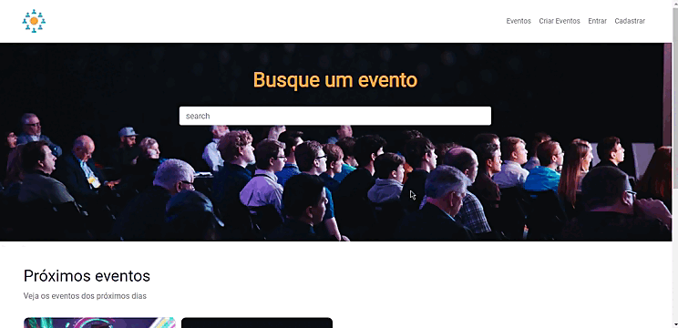
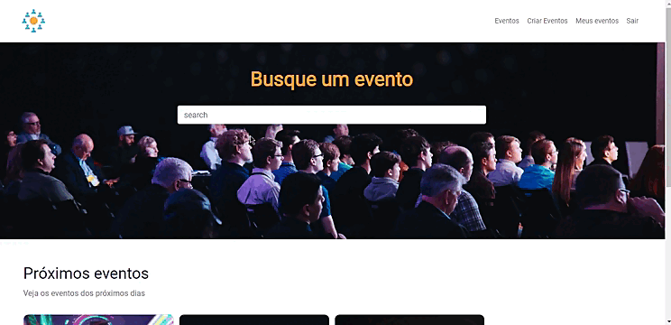
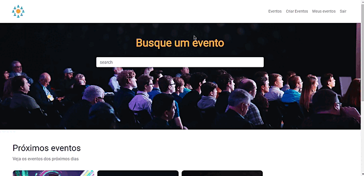
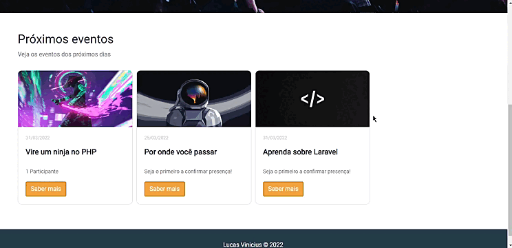

    
    
    
    

    Projeto desenvolvido para solidificar conhecimentos de como criar layouts dinâmicos com o Blade e como fazer a relação de objetos com o Banco de dados usando como ORM o Eloquent

    

<h3>Criação de novos eventos</h3>

    

    

<h3>Pesquisar por eventos</h3>

    

  

<h3>Edição de eventos</h3>

    

 

<h3>Confirmação de presença</h3>

         

 
